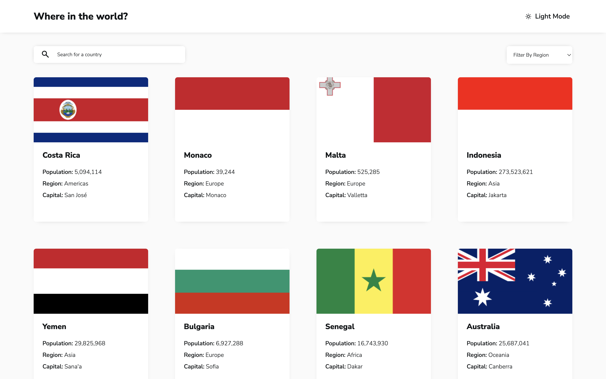

# Frontend Mentor - REST Countries API with color theme switcher solution

This is a solution to the [REST Countries API with color theme switcher challenge on Frontend Mentor](https://www.frontendmentor.io/challenges/rest-countries-api-with-color-theme-switcher-5cacc469fec04111f7b848ca). Frontend Mentor challenges help you improve your coding skills by building realistic projects.

## Table of contents

- [Overview](#overview)
  - [The challenge](#the-challenge)
  - [Screenshot](#screenshot)
  - [Links](#links)
- [My process](#my-process)
  - [Built with](#built-with)
  - [What I learned](#what-i-learned)
  - [Continued development](#continued-development)
  - [Useful resources](#useful-resources)
- [Author](#author)
- [Acknowledgments](#acknowledgments)

## Overview

### The challenge

Users should be able to:

- See all countries from the API on the homepage
- Search for a country using an `input` field
- Filter countries by region
- Click on a country to see more detailed information on a separate page
- Click through to the border countries on the detail page
- Toggle the color scheme between light and dark mode _(optional)_

### Screenshot



### Links

- Solution URL: [https://github.com/namasSinjali/rest-countries-api-with-color-theme-switcher-master.git](https://github.com/namasSinjali/rest-countries-api-with-color-theme-switcher-master.git)
- Live Site URL: [https://where-in-the-earth.vercel.app/](https://where-in-the-earth.vercel.app/)

## My process

### Built with

- Semantic HTML5 markup
- CSS custom properties
- Flexbox
- CSS Grid
- Mobile-first workflow
- [Svelte](https://svelte.dev/) - JS library
- [SvelteKit](https://kit.svelte.dev/) - Svelte framework

### What I learned

- Dark/Theme:
  - Media query:
  ```css
  @media ("prefers-color-scheme: dark") {
  }
  ```
  - Using custom properties
- Sending `fetch` request and handling response
- Async functions and promises
- Dynamic routes in [SvelteKit](https://kit.svelte.dev/)
- URL and searchParams
- Shuffling array algorithm - [Fisher–Yates Shuffle](https://bost.ocks.org/mike/shuffle/)

### Continued development

- Caching data
- Handling errors while fetching data
- Improve accessibility

### Useful resources

- [Svelte](https://www.svelte.dev/) - Great place to start learning svelte framework
- [SvelteKit](https://www.kit.svelte.dev/) - Official docs to look and awesome discord community.
- [Fisher–Yates Shuffle](https://bost.ocks.org/mike/shuffle/) - Visualization of the shuffling algorithm.
- [Css-tricks](https://css-tricks.com/) - Helped me with layouts and applying themes

## Author

- Frontend Mentor - [@namasSinjali](https://www.frontendmentor.io/profile/namasSinjali)
- GitHub - [@namasSinjali](https://github.com/namasSinjali)
- LinkedIn - [Namas Thapa](https://np.linkedin.com/in/namas-thapa-046850202)

## Acknowledgments

I would like to thank [FrontEnd Mentor](https://www.frontendmentor.io/) for the design, authors of [REST country api](https://restcountries.com/) and all the developers and teachers who made these tools and taught using them.

Thank You!! 🙏
